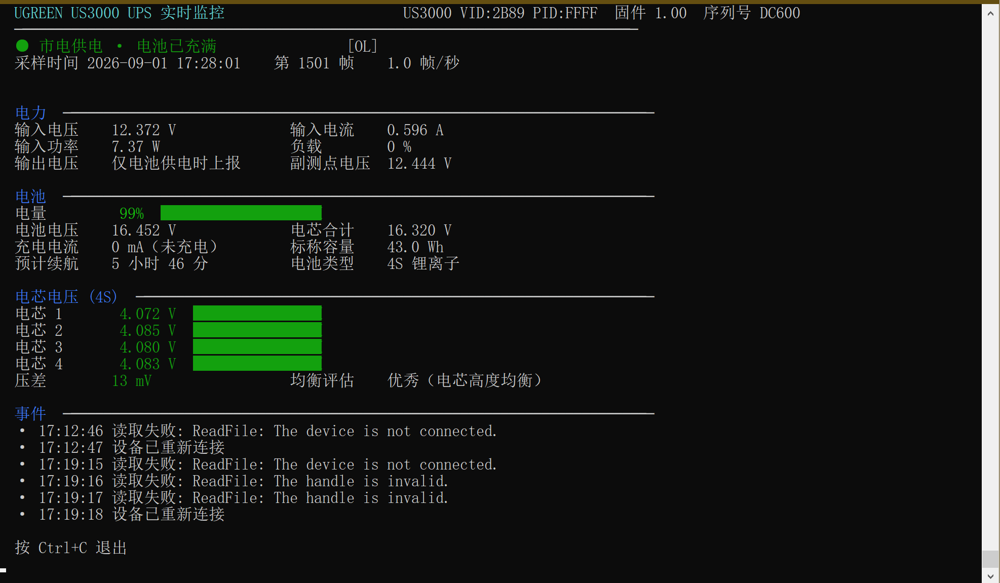
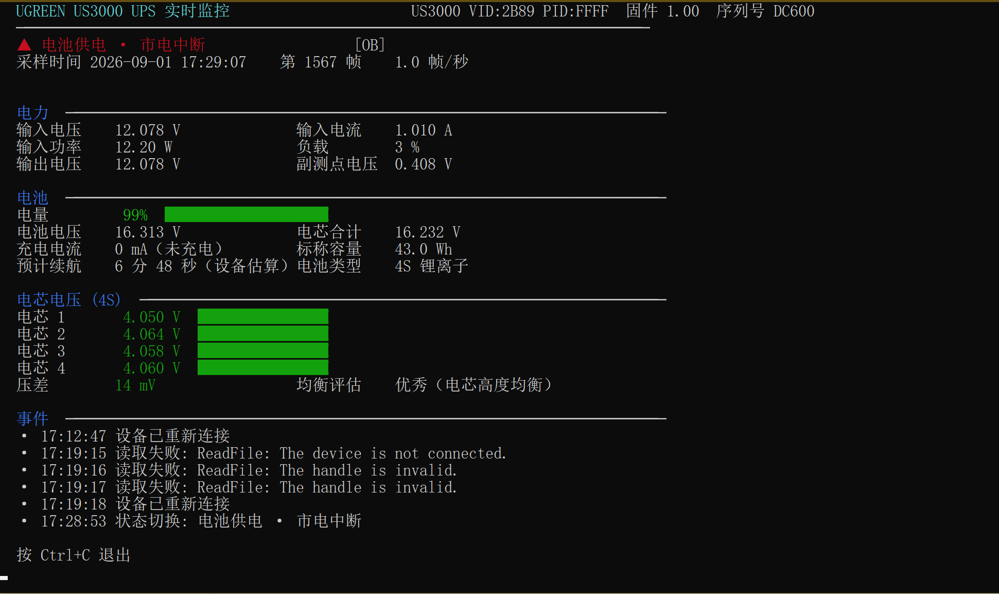
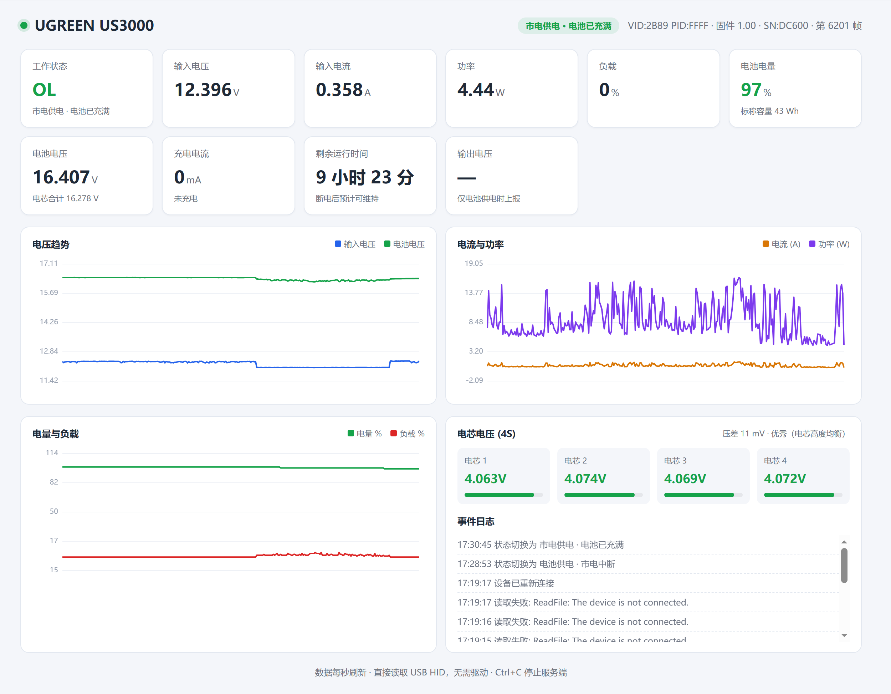
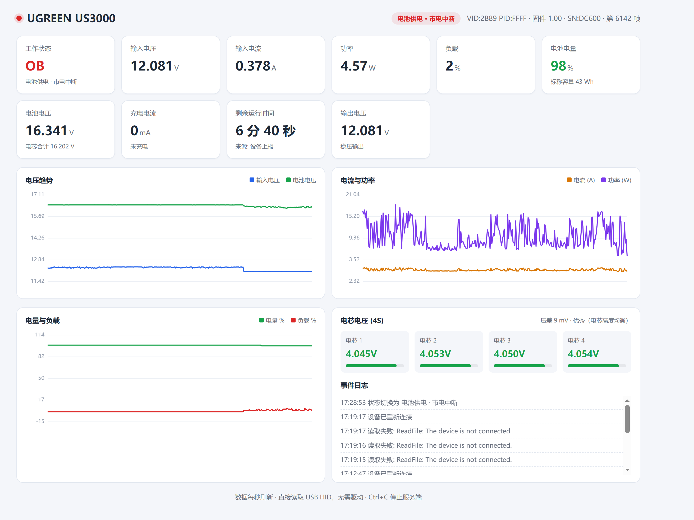

# UGREEN US3000 UPS 监控工具

通过 USB HID 直接读取绿联 UGREEN US3000 UPS 遥测数据的 Go 程序。**纯 Go 实现、无需 cgo、无需安装任何驱动或厂商软件。**

界面为 **Go 原生 GUI 窗口 + 系统托盘**（基于纯 Go 的 [`lxn/walk`](https://github.com/lxn/walk)，同样不依赖 cgo，不再是 cmd 控制台窗口）；同时内置 **Web 仪表盘**，便于手机或其他设备查看。

设备标识：`VID:2B89 PID:FFFF`，固件 **`V3.3`**（取自私有遥测帧头，见[协议说明](#协议说明)）。

> ⚠️ 固件版本不要读 USB 的 `bcdDevice`。该设备的 USB 设备描述符里 `bcdDevice = 0x0100`（显示为 `1.00`），
> 那只是 USB 接口版本号；厂商把真正的固件版本放在私有帧头的 `[1]/[2]` 字节里。
> 程序会分别展示 **固件 V3.3** 与 **USB 1.00**，不再把后者冒充当固件版本。

---

## 快速开始

```bash
# 启动原生 GUI 窗口 + 系统托盘（默认）
ups-monitor.exe

# 仅后台运行 Web 服务，无窗口/托盘（端口随机、仅本机可访问）
ups-monitor.exe -tray=false

# 指定 Web 端口（默认每次启动随机）
ups-monitor.exe -web 127.0.0.1:9000

# 终端实时面板（需从 cmd 等控制台窗口启动）
ups-monitor.exe -console

# 读取一次并以 JSON 输出（便于脚本集成，支持 > file 重定向）
ups-monitor.exe -once -json

# 列出系统中所有 HID 设备（以 GUI 窗口展示）
ups-monitor.exe -list
```

> 程序以 GUI 子系统编译（无控制台窗口）。双击即出现 GUI 窗口并常驻托盘；`-console` / `-once -json` 会自动接回启动它的控制台。

## GUI 窗口与系统托盘

- 启动后显示 Go 原生 GUI 窗口，实时展示状态、电力、电池、电芯与低电量保护配置，约每秒刷新。
- **点击窗口关闭按钮 → 最小化到托盘继续运行**（不退出）。需要再次查看时，右键托盘图标选「打开 GUI」。
- 右键托盘图标有三个菜单项：**打开 Web 页面**（浏览器打开内嵌仪表盘）、**打开 GUI**（重新显示窗口）、**退出**（停止监控并退出）。
- **Web 端口每次启动随机**（绑定 `127.0.0.1`，仅本机可访问，不会占用固定的 8080）；「打开 Web 页面」始终指向本次实际端口。
- **电芯电压图形化**：电芯分组为自绘图表 —— 上半部分是 4 节电芯的**柱状图**（柱顶连折线，最低的一节用暖色标出，虚线为平均值参考线），下半部分是**压差（最大−最小）随时间的折线图**，右侧实时标出 `当前 / 最大 / 最小` 压差。
- **版本号如实展示**：横幅下方一行同时给出 `固件 V3.3 · 硬件 V1 · USB 1.00 · 序列号 xxx`，USB 接口版本与固件版本不再混淆。
- **剩余续航双口径**：电池分组里 `设备续航` 与 `本地估算` 并列，下方一行小字说明估算依据（如 `41.7 Wh 可用容量 ÷ 5.23 W 负载`）。
- **触发动作用单选按钮**而非下拉框：下拉列表在部分远程桌面 / 高 DPI 环境下展开后立即收起，改为常驻可见的四个单选项（关机 / 睡眠 / 休眠 / 仅提示），一眼看全所有选项。
- **长期运行信息常驻底部**：显示 `已运行 x · 累计 n 帧 · 日志按 2 MiB × 3 份滚动`。
- **诊断**：GUI 程序没有控制台，启动步骤与错误会写入**与可执行文件同目录**的 `ups-monitor.log`；发生崩溃时还会弹出错误对话框（不依赖 GUI 库，确保能看到原因）。

## 截图

**终端实时面板**

| 市电供电 | 电池供电 |
|----------|----------|
|  |  |

**Web 仪表盘**

| 市电供电 | 电池供电 |
|----------|----------|
|  |  |

## 命令行参数

| 参数 | 默认值 | 说明 |
|------|--------|------|
| `-tray` | true | `true`=GUI 窗口 + 系统托盘（默认）；`false`=仅后台 Web 服务，无窗口/托盘 |
| `-console` | false | 以终端实时面板运行（需从 cmd 等控制台窗口启动） |
| `-web <addr>` | 随机 | 指定 Web 仪表盘监听地址（如 `-web 127.0.0.1:9000`）；缺省时随机端口且仅监听本机 |
| `-no-browser` | false | 不自动打开浏览器 |
| `-once` | false | 只读取一帧即退出 |
| `-json` | false | 以 JSON 格式输出（配合 `-once`） |
| `-list` | false | 以 GUI 窗口枚举系统中所有 HID 接口及其 UsagePage |
| `-csv <file>` | 无 | 同时将每帧数据追加写入 CSV 文件（终端面板模式） |
| `-raw` | false | 额外输出原始帧的十六进制 |
| `-i <ms>` | 1000 | 采样间隔（毫秒） |
| `-low <n>` | 0 | 电量低于该百分比时自动执行电源动作（0=关闭，范围 1–100） |
| `-action <a>` | shutdown | 低电量动作：`shutdown`(关机) / `sleep`(睡眠) / `hibernate`(休眠) |

## 当前实测数据

```
状态        市电供电 · 电池已充满 (OL)
输入电压    12.318 V        输入电流    1.112 A
输入功率    13.70 W         负载        0 %
电池电压    16.536 V        电量        100 %
电芯电压    4.086 / 4.108 / 4.100 / 4.107 V（压差 22 mV）
预计续航    约 3 小时（按 43 Wh 容量与当前功率估算）
```

## 重要：这是直流 UPS

US3000 **不是**传统的交流 UPS。其输入为外置电源适配器的直流电（12V/19V/20V），输出为 **12V 直流**，用于给 NAS、路由器等设备供电。因此：

- 表中出现的电压是 **直流电压**，不应按 220V 市电理解；
- 电池组为 **4 节锂离子电芯串联（4S）**，满电约 16.4–16.6V；
- 标称容量 **43 Wh**（3000 mAh × 14.4V）。官方宣传的 "12000 mAh" 是四节电芯容量之和，不能直接用于能量计算。

## 设备接口

设备通过 USB 暴露两个 HID 集合（Top-Level Collection）：

| 接口 | UsagePage | 用途 |
|------|-----------|------|
| COL01 | `0xFF00` | 绿联私有遥测，Report ID `0x71`，64 字节，**每秒主动上报** — 本程序的主要数据源 |
| COL02 | `0x0084` | 标准 HID Power Device，被 Windows 电池驱动占用；仅用于 Feature 报告交叉校验 SOC |

Windows 会将 COL02 识别为"HID UPS 电池"，这是正常现象。本程序读取 COL01 获取完整遥测，避免了与系统驱动的冲突。

## 协议说明（固件 V3.3）

私有帧为 64 字节，偏移均**包含开头的 Report ID**（即 `data[0] == 0x71`）。

### 帧头（所有模式）

| 偏移 | 解码 | 含义 |
|------|------|------|
| `[0]` | 原始字节 | Report ID，固定 `0x71` |
| `[1]` `[2]` | 原始字节 | **固件主版本 / 次版本**（实测 `03 03` → `V3.3`） |
| `[3]` | 原始字节 | 硬件版本（实测 `01` → `V1`） |
| `[4]` `[5]` | 原始字节 | 私有协议主 / 次版本（实测 `02 02` → `2.2`） |
| `[6]` | 原始字节 | 保留（实测恒为 `0x16`） |
| `[7]` | 见下表 | 状态字节 |

### 状态字节 `data[7]`

| 值 | 含义 |
|----|------|
| `0x26` | 市电供电，电池已充满（OL） |
| `0x36` | 市电供电，电池充电中（OL CHRG） |
| `0x21` | 电池供电，市电中断（OB） |

### 通用字段（所有模式）

| 偏移 | 解码 | 含义 |
|------|------|------|
| `[16-17]` | BE u16 | OL：直流输入电压（V，÷1000）；OB：剩余运行时间（秒） |
| `[18-19]` | BE u16 ÷1000 | OL：直流输入电压（V）；OB：稳压输出电压（V） |
| `[22-23]` | BE u16 ÷1000 | 电池组总电压（V） |
| `[24-25]` | BE u16 ÷1000 | OL：输入电流（A）；OB：电池放电电流（A） |
| `[29-30]` | BE u16 | 充电电流（mA），仅在 OL CHRG 有效 |
| `[35-36]` `[37-38]` `[39-40]` `[41-42]` | BE u16 ÷1000 | 第 1–4 节电芯电压（V） |
| `[43]` | 原始字节 | 电池电量百分比 |
| `[30]` / `[31]` | 原始字节 | 负载百分比（OL 取 `[30]`，OB 取 `[31]`） |

> `[16-17]` 与 `[18-19]` 是两个不同的电压测量点，实测相差约 70–100 mV，属正常现象。

### Feature 报告（COL02，用于校验）

| 报告 ID | 内容 |
|---------|------|
| `0x06 [1]` | BMS 上报的 SOC（%），用于校准 `[43]` |
| `0x06 [2-5]` | LE u32 剩余秒数，`0xFFFFFFFF` 表示市电正常时不可用 |
| `0x01` | PresentStatus 位域，bit 7 为 NeedReplacement（需更换电池） |
| `0x10` | `iManufacturer/iProduct/iSerial`、`iVersionNumber` 等字符串索引字段 |

> ⚠️ **不要用 `HidD_GetIndexedString` 去遍历字符串描述符索引来取版本号。**
> 实测该固件对上位机按索引取字符串的请求会卡住：每个不存在的索引都要走一次控制传输超时
> （约 3.5 s），连续扫下来还会把设备固件挂死，**必须重新插拔 USB 才能恢复**。
> 固件版本请直接读私有帧头 `[1]/[2]`（见上）。

### 已知未解析字段

`[20-21]`、`[28]`、`[32]`、`[45]`、`[46]` 含义未确认，程序不予展示。其中 `[28]` 呈约 15 分钟周期震荡，推测与充电器状态机相关，而非温度。

### 剩余运行时间的两个口径

界面上「剩余续航」给出两个**并列**的值，二者口径不同、不能互相替代：

| 来源 | 说明 |
|------|------|
| **设备续航** | 设备上报值，来自 `[16-17]`。**只有电池供电（OB）时固件才给**，市电时该字段被输入电压复用 |
| **本地估算** | `可用容量 ÷ 负载功率`，任何时候都能算：`43 Wh × SOC ÷ LoadPowerW` |

`LoadPowerW` 的口径（`protocol.Sample.LoadPowerW`）：

- 电池供电：`输出电压 × 放电电流`，即输出端实测功率；
- 市电供电：`输入功率 − 充电功率`。**必须扣掉充电那部分**——市电时输入功率里混着给电池
  充电的功率，不扣会系统性低估续航（旧实现就踩了这个坑）。充电功率按
  `电池组电压 × 充电电流(mA)/1000` 折算。

负载低于 0.5 W 或电量为 0 时不给估算值（返回 `—`），避免出现误导性的大数字。

## 长期运行

程序按「连续运行数年」设计，所有会增长的东西都有界：

| 资源 | 上限 | 说明 |
|------|------|------|
| `ups-monitor.log` | 2 MiB × (1 + 3) | 写满即滚动，历史文件 `.1`/`.2`/`.3`，更旧的丢弃 |
| 历史采样环形缓冲 | 1800 点 | 约 30 分钟 @1 Hz，供图表使用 |
| 事件列表 | 20 条（Web）/ 6 条（终端） | 只保留最近若干条 |
| 帧计数 | `int`（64 位） | 1 Hz 下约 2920 亿年才会溢出 |

界面会同时显示**已运行时长**和**累计帧数**——单看一个孤零零的帧数说明不了什么，
配上运行时长才读得懂；时长超过一天会按「天 / 年」折算，不会显示成 `8760 小时 0 分`。

日志滚动发生在写入超过上限的那一行之后，新文件的头一行会写明滚动原因，
所以 `.1` 里保留的是滚动前的内容，不会丢。

## 测试

```bash
go test ./...
```

- `protocol/protocol_test.go`：用**实测抓包**校对字段解码与固件版本解析，
  并覆盖两种供电模式下的续航口径、充电功率扣减、以及各种不可用边界；
- `cmd/ups/log_test.go`：验证日志按大小滚动、历史份数封顶、以及启动时发现超限日志立即滚动。

> 采集类测试不需要真实设备，全部基于固定帧数据，可在 CI 上跑。

## 代码结构

```
ugreen-ups/
├── cmd/ups/              主程序
│   ├── main.go           入口、终端面板、JSON 输出、低电量保护接线
│   ├── gui_windows.go    Go 原生 GUI 窗口 + 系统托盘（lxn/walk）+ 崩溃日志
│   ├── power_windows.go  低电量保护状态机、电源动作、开机自启
│   ├── web.go            HTTP 服务与采集器（单一监控源）
│   ├── log_test.go       日志滚动测试（大小上限 / 历史份数封顶）
│   ├── app.manifest      应用程序清单（Common Controls 6.0 + DPI 感知）
│   ├── rsrc.syso         清单 + 图标资源（由 rsrc 生成，编译时自动链接）
│   └── assets/
│       ├── dashboard.html  Web 仪表盘（内嵌，无外部 CDN 依赖）
│       └── icon.ico        托盘/窗口图标（内嵌）
├── hid/                   Windows HID 驱动（纯 syscall，无 cgo）
│   └── hid.go             setupapi / hid.dll / kernel32 封装
├── protocol/              协议解析
│   ├── protocol.go        64 字节帧解码、版本解析、续航估算
│   └── protocol_test.go   单元测试（基于实测抓包，无需真机）
├── probe/                 诊断工具：枚举设备、读取用法能力与原始报告
├── sample/                诊断工具：长时采样并统计逐字节变化
├── tools/uicheck/         GUI 自检脚本（纯 Python 标准库，无需第三方依赖）
│   ├── screenshot.py      截取 GUI 窗口为 PNG（用于在无人工干预时核对界面）
│   ├── dump_window.py     导出窗口/控件树（类名、客户区坐标、文本），排查布局问题
│   └── click_radio.py     模拟点击单选按钮并点「保存设置」，端到端验证配置确实写盘
└── ups-monitor.exe        编译产物
```

> `tools/uicheck` 需要在程序运行时执行，且应在仓库根目录下用目标 Python 运行，例如
> `python tools/uicheck/screenshot.py`（输出 `ui_shot.png`）。
> 三个脚本都会先声明 DPI 感知——否则 Windows 的 DPI 虚拟化会让截图与坐标失真。

### 为什么不用现成的 HID 库

环境未安装 C 编译器（`CGO_ENABLED=0`），主流 HID 库（如 `karalabe/hid`、`go-hid`）依赖 cgo/hidapi 无法编译。因此 `hid` 包直接通过 `syscall` 调用 Windows 原生 API：

- `setupapi.dll`：设备枚举与接口路径获取
- `hid.dll`：属性、报告描述符、用法能力、Feature 报告
- `kernel32.dll`：`CreateFileW` + Overlapped `ReadFile`（带超时）

该实现同时规避了 Linux hidraw 方案在 Windows 上的不适用性。

## 辅助诊断工具

若后续固件升级导致协议变化，可用内置工具重新分析：

```bash
go run ./probe  -vid 2B89 -n 5        # 枚举设备、打印用法能力与原始报告
go run ./sample -n 120 -i 1000        # 采样 2 分钟，输出逐字节统计以定位字段
```

## 编译

```bash
# 编译为 GUI 程序（无控制台窗口，默认）
go build -ldflags "-H windowsgui" -o ups-monitor.exe ./cmd/ups/
```

> `-ldflags "-H windowsgui"` 将程序编译为 **GUI 子系统**，运行时不出现 cmd 控制台窗口。
> 若去掉该参数则编译为控制台程序（不会自动出现 GUI 窗口，但 `-console` / `-once` 可直接在 cmd 中使用）。

**为什么必须有 `cmd/ups/rsrc.syso`**：GUI 基于的 `lxn/walk` 依赖 **Common Controls 6.0**，
可执行文件必须携带应用程序清单（manifest），否则创建窗口会失败——典型表现为
`TTM_ADDTOOL failed` 或「双击运行立刻闪退」。仓库已包含由 `cmd/ups/app.manifest` 生成的
`cmd/ups/rsrc.syso`（内含清单 + 图标资源），Go 链接器会自动链接同目录下的 `*.syso`，
因此直接 `go build` 即可，无需额外步骤。

修改清单或图标后需重新生成：

```bash
go run github.com/akavel/rsrc@latest \
  -manifest cmd/ups/app.manifest -ico cmd/ups/assets/icon.ico -arch amd64 -o cmd/ups/rsrc.syso
```

要求 Go 1.20+，仅支持 Windows（依赖 Win32 HID API）。国内网络建议：

```bash
go env -w GOPROXY=https://goproxy.cn,direct
```

## 使用建议

1. **长期监控**：`ups-monitor.exe -web :8080 -csv ups.csv`，同时获得可视化与原始数据。
2. **断电演练**：确认市电中断后程序能否在约 3 秒内切换到 OB 状态（程序内置 3 帧去抖）。
3. **电池健康**：关注"压差"指标。新电池约 20–30 mV，若长期超过 150 mV 说明电芯一致性下降。
4. **续航估算**：市电模式下按 `43Wh × SOC ÷ 当前功率` 推算；实际断电后改用设备上报值，更为准确。

## 低电量自动保护

市电中断、UPS 仅靠电池供电时，可在电量耗尽前让电脑安全退场。**设置无需修改启动参数**——既可用命令行一次性指定，也能在运行时通过终端菜单或网页随时修改并保存。

### 命令行（一次性）

```bash
ups-monitor.exe -low 20                      # 电量<20% 自动关机（默认动作）
ups-monitor.exe -low 15 -action sleep        # 电量<15% 睡眠
ups-monitor.exe -web :8080 -low 10 -action hibernate  # Web 模式 + 电量<10% 休眠
```

### 终端交互菜单

运行终端面板时，输入 `c` 回车即可进入设置菜单，无需停止监控：

```
低电量自动保护 · 设置

  当前状态: 已启用（电量 < 20% 时 关机）

  1) 修改电量阈值（当前 20%）
  2) 修改动作（当前 关机）
  3) 启用/禁用保护
  4) 保存并返回
  q) 不保存退出
```

- 选 `1` 输入电量阈值（0=禁用），选 `2` 选择 `关机 / 睡眠 / 休眠 / 仅提示`，选 `3` 启用或禁用；
- 选 `4` 写入配置文件 `ups-monitor.json` 并立即生效；`q` 放弃修改。
- 终端面板底部提示：`按 c 进入设置 · Ctrl+C 退出`（另外输入 `q` 可直接退出程序）。

### 网页设置

Web 仪表盘底部新增"低电量自动保护"卡片：勾选启用、填写电量阈值、选择动作，点"保存"即生效并持久化，无需重启服务。卡片标题实时显示当前启用状态。

### 配置文件

设置保存在**与可执行文件同目录**的 `ups-monitor.json`：

```json
{
  "low": 20,
  "action": "shutdown"
}
```

- 程序启动时：**若给定 `-low`/`-action` 启动参数则优先并回写配置；否则读取该文件；都没有则默认禁用。**
- 运行时修改（菜单或网页）即时生效，并覆盖文件内容。
- 该文件已被 `.gitignore` 忽略，不会进入版本库（每台机器独立配置）。

### 行为要点

1. **仅在电池供电（OB）模式下触发**。市电供电（OL）时即便电量读数偏低也**不会**动作——避免老旧电池在插电状态下被误判而关机。
2. **连续 3 帧确认**：必须连续 3 次采样都满足"电池模式 + 电量低于阈值"才执行动作，过滤瞬时抖动与偶发错误读数。
3. **单次触发**：本会话内只执行一次。睡眠/休眠恢复后若电量仍低也不会再次触发，避免反复开关机。
4. **动作可靠性**：`shutdown`(关机) 与 `hibernate`(休眠) 通过系统 `shutdown.exe` 执行，稳定可靠；`sleep`(睡眠) 调用 Windows `SetSuspendState` 电源 API，绝大多数环境可用，个别环境失败时会回退到 `rundll32` 并写入事件日志；`none`(仅提示) 只记录事件、不执行任何电源动作。

> 建议在断电演练中验证：临时把阈值设到略高于当前电量（例如当前 100% 时设 99%），观察是否按预期关机/睡眠，确认无误后再设为真正想要的保护阈值。

## 更新日志

- **固件版本修正（V3.3）**：此前显示的 `1.00` 实为 USB `bcdDevice`（USB 接口版本），并非固件版本。现改为解析私有遥测帧头 `[1]/[2]` 得到真实固件版本 **V3.3**，并同时展示硬件版本 `V1`、私有协议 `2.2`，与 USB 版本分列、互不冒充。附带 `protocol_test.go`：用 8 帧真机抓包离线验证版本解析，无需连接设备。
- **剩余运行时间双口径**：电池分组并列展示 `设备续航`（固件上报，仅在电池供电时有效）与 `本地估算`（按可用容量 ÷ 实际负载功率推算，市电充电时会扣除充入电池的功率），下方小字给出估算依据；两者都没有时显示 `—` 而非误导性的数字。
- **长期运行适配**：日志按 **2 MiB × 3 份**自动滚动（`ups-monitor.log` → `.1` → `.2` → `.3`），启动时若发现超限立即滚动；GUI 底部常驻 `已运行 x · 累计 n 帧 · 日志按 2 MiB × 3 份滚动`，帧计数用千位分隔，时间显示支持「天 / 年」量级。运行数年也不会撑爆磁盘或让界面数字溢出。附带 `log_test.go` 覆盖滚动、历史份数上限与启动即超限三种场景。
- **原生 GUI + 系统托盘**：改用 Go 原生 GUI 窗口（纯 Go 的 `lxn/walk`，非 cmd 控制台），默认以 GUI 子系统编译（无控制台窗口）；关闭窗口最小化到托盘继续运行，右键托盘图标可选「打开 Web 页面」「打开 GUI」「退出」；Web 端口每次启动随机且仅监听本机；终端面板改由 `-console` 显式启用。
- **交互式低电量配置**：新增终端设置菜单（运行中输入 `c` 进入）与 Web 仪表盘设置卡片，可随时修改"电量阈值 / 动作（关机·睡眠·休眠·仅提示）/ 启用禁用"，并持久化到 `ups-monitor.json`；启动参数 `-low`/`-action` 仍可在首次运行时覆盖并回写。详见 [低电量自动保护](#低电量自动保护)。
- **低电量自动保护**：市电中断、仅靠电池供电时，按阈值自动关机 / 睡眠 / 休眠（仅电池模式触发，连续 3 帧确认，单次触发）。
- **基础监控**：通过 USB HID 直读 UGREEN US3000 遥测，提供终端实时面板 / JSON 输出 / Web 仪表盘三种用法，纯 Go 实现、零第三方依赖、免驱动。

## 免责声明

协议字段依据实测与公开逆向资料整理，随固件版本可能变化。本工具仅做**只读**监控，不向设备写入任何控制指令。
